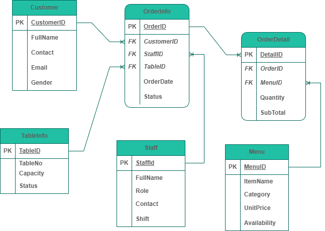

# Restaurant Management System (PostgreSQL)

This project is a **Restaurant Management System** database built using **PostgreSQL** and managed through **pgAdmin**.  
It is designed to efficiently handle restaurant operations such as managing customers, menu items, orders, and staff.

## Project Overview

The **Restaurant Management System** aims to provide a structured way to manage daily restaurant data.  
It demonstrates database design principles, and SQL query.

Key features:

- Centralized database for restaurant operations
- Management of menu items, orders, staffs, and customers
- Querying and reporting using SQL
- Referential integrity via foreign keys

## Database Schema

### Main Tables:

- **Customer** – Stores customer details
- **Staff** – Information about restaurant staff
- **Menu** – Contains the list of food and beverage items
- **OrderInfo** – Tracks customer orders
- **OrderDetail** – Junction table linking orders and menu items
- **TableInfo** – Contains information about tables

### Entity Relationship Diagram (ERD)



> I have used: [Draw.io](https://app.diagrams.net/) to visualize my schema.

## Installation & Setup

### Prerequisites

- PostgreSQL (v14 or higher)
- pgAdmin 4
- SQL scripts included in this repository

### Setup Steps

1. **Clone this repository:**
   ```bash
   git clone https://github.com/joyeusemahoro/Advanced_database_technology.git
   cd Advanced_database_technology
   ```

### Create a new database in pgAdmin:

CREATE DATABASE joyRestaurentDB;

### Execute SQL scripts in:

schema.sql

### Example queries:

### Example Queries

<!-- Q6. Daily Sales Report per Staff -->

```sql
SELECT
    s.FullName AS StaffName,
    DATE(o.OrderDate) AS SaleDate,
    SUM(od.SubTotal) AS TotalSales
FROM OrderInfo o
JOIN Staff s ON o.StaffID = s.StaffID
JOIN OrderDetail od ON o.OrderID = od.OrderID
GROUP BY s.FullName, DATE(o.OrderDate)
ORDER BY SaleDate, StaffName;

```

<!-- Q4. Retrieving top 3 most frequently ordered menu items -->

```sql
SELECT
    m.ItemName,
    COUNT(od.MenuID) AS TimesOrdered
FROM OrderDetail od
JOIN Menu m ON od.MenuID = m.MenuID
GROUP BY m.ItemName
ORDER BY TimesOrdered DESC
LIMIT 3;

```

### Project Structure

Advanced_database_technology/
├── schems.sql
├── images/
│ └── ERD.png
└── README.md

### Future Improvements

- Include stored procedures for generating daily reports

- Integrate role-based access for employees

- Create a front-end interface for order management

### Author

MAHORO Joyeuse
[joyeusemah@gmail.com](https://mail.google.com/mail)  
[GitHub Profile](https://github.com/joyeusemahoro)

### License

This project is for educational purposes only.
